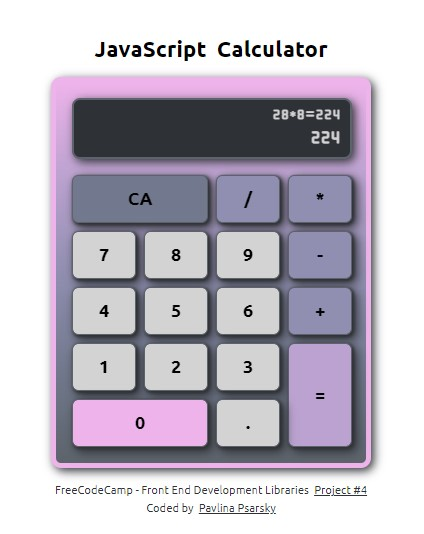

## freeCodeCamp - Front End Development Libraries Project

# Build a JavaScript Calculator

This is my solution to the [Build a JavaScript Calculator](https://www.freecodecamp.org/learn/front-end-development-libraries/front-end-development-libraries-projects/build-a-javascript-calculator), the fourth of 5 projects to earn the Front End Development Libraries certification. FreeCodeCamp's mission is to help people learn to code for free.

## Table of contents

- [Overview](#overview)
  - [The challenge](#the-challenge)
  - [Screenshot](#screenshot)
  - [Links](#links)
- [My process](#my-process)
  - [Built with](#built-with)
  - [What I learned](#what-i-learned)
  - [Continued development](#continued-development)
  - [Useful resources](#useful-resources)
- [Author](#author)
- [Acknowledgments](#acknowledgments)

## Overview

### The challenge

Fulfill the user stories and get all of the tests to pass. You can use any mix of HTML, JavaScript, CSS, Bootstrap, SASS, React, Redux, and jQuery to complete this project.

### Screenshot

### Links

- Solution URL: https://github.com/PavlinaPs/javascript-calculator-react
- Live Site URL: https://pavlinaps.github.io/javascript-calculator-react

## My process

It took me forever and several attempts, but it finally passes all FreeCodeCamp tests (and also my husband's and children's fooling around :-)).
This is my first use of the useReducer hook.

### Built with

- React.js

### What I learned

I learned really a lot and also I'm happy I could rely on my previous JavaScript knowledge. The order of learning seems to be correct.
useReducer first looked very complicated, but in fact it is not and I can see its advantages in maintaining state.

### Continued development

I still have a long road ahead of me, learn more hooks, custom hooks, CRUD, APIs, etc.

### Useful resources

- [Learn useReducer In 20 Minutes](https://www.youtube.com/watch?v=kK_Wqx3RnHk) - Web Dev Simplified
- [The Perfect Beginner React Project](https://www.youtube.com/watch?v=DgRrrOt0Vr8) - Web Dev Simplified
- [regexr.com](https://regexr.com/) - a great site for testing regular expression

## Author

- Website - [My portfolio](https://pavlinaps.github.io/my-portfolio/)
- freeCodeCamp - [@pavlina1](https://www.freecodecamp.org/pavlina1)
- Frontend Mentor - [@PavlinaPs](https://www.frontendmentor.io/profile/PavlinaPs)
- Codewars - [PavlinaPs](https://www.codewars.com/users/PavlinaPs)
- Twitter - [@PPsarsky](https://www.twitter.com/PPsarsky)

## Acknowledgments

It is great that I can learn to code with freeCodeCamp. I really appreciate what they are doing for the coding community. The projects are all very useful for me. All of them. Thank you!
